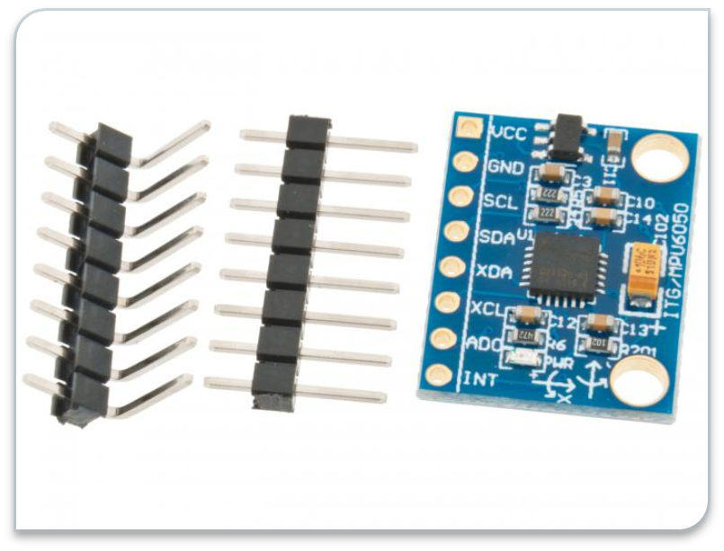
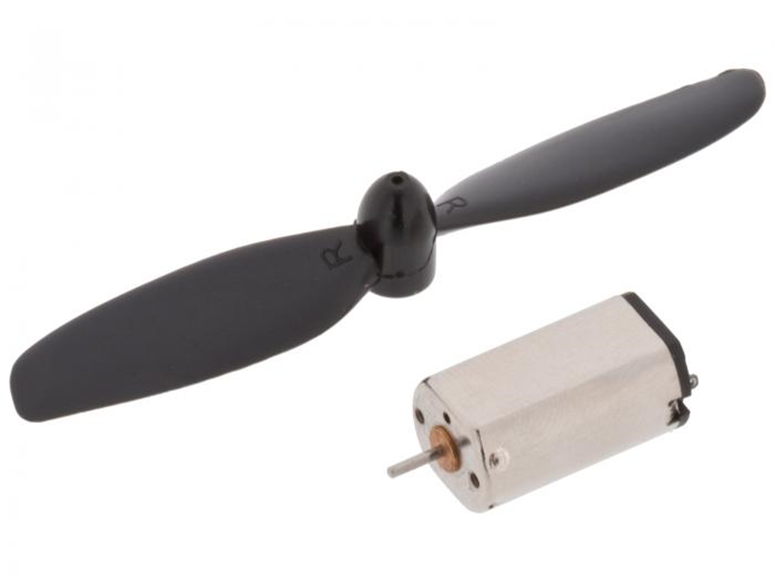
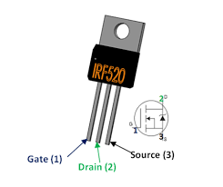
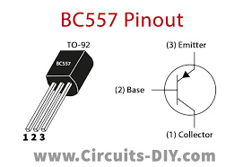
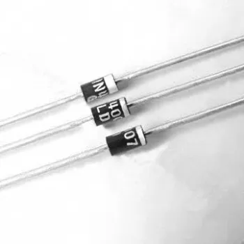
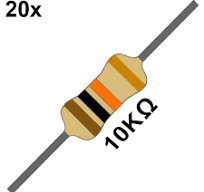
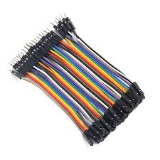
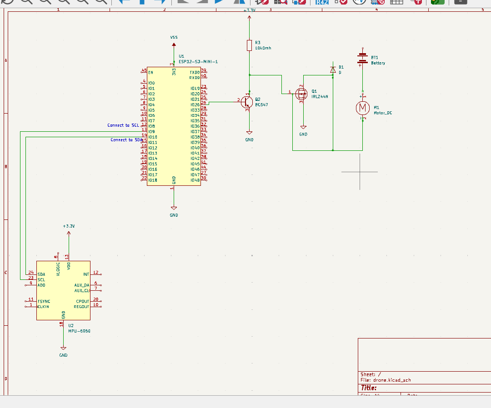
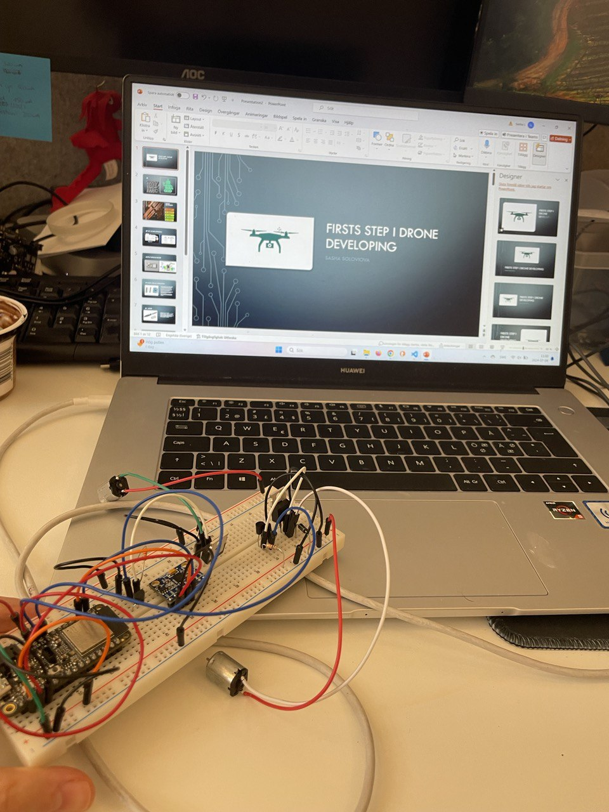

# MPU 6050 controlling DC motors using ESP32-s3 Feather
Sasha Soloviova ss226sh

3Dcubb visualization of accelerometer and gyrometer values from MPU-6050 using ESP32-S3 MCU. The results are displayed on a local web server using Wi-Fi.Data is read directly from registers using the C language. Accel X value is controling 2 dc-motors.

I had a problem with the installation of Espressif IDF, it can take some extra time. Besides that, it will take approximately 1 day.

It is my dream to build a drone from scratch. This is the first step in my drone project. These values from MPU 6050 will help define the drone's position and assist in self-adjusting its orientation and controlling DC motors.By building this project, I will gain a good understanding of how the ESP-IDF works, how to read and visualize sensor values, how to controll motors with PWM, and much more.

| Produkt | Bild | Beskrivning |
|---------|------|-------------|
| [MC- Esp32-s3](https://www.amazon.se/Adafruit-Feather-ESP32-S3-Flash-PSRAM/dp/B0B2DH5T9C) |  | MC -Esp32-s3 is a microcontroller made by . It has dual-core processors running up to 240 MHz, with Wi-Fi and Bluetooth for wireless connections. The ESP32-S3 includes UART, SPI, I2C, and ADC interfaces for connecting sensors and devices. Low power consumption. (Se datasheet [här](https://cdn-learn.adafruit.com/downloads/pdf/adafruit-esp32-s3-feather.pdf)) |
| [MPU 6050](https://www.electrokit.com/mpu-6050-accelerometer-3-axel-gyro-monterad-pa-kort) |  | Sensor MPU 6050 kombinerar en 3-axlig accelerometer och en 3-axlig gyroskop. Detta gör att den kan mäta både acceleration och rotationshastighet. Kommunicerar med mikrokontroller via I2C (Inter-Integrated Circuit)-protokoll. (Se datasheet [här](https://cdn.sparkfun.com/datasheets/Sensors/Accelerometers/RM-MPU-6000A.pdf)) |
| [DC Motor](https://www.electrokit.com/dc-motor-med-flaktblad-3-6v) |  | DC motor with fan blades, dimensions: 20 x 12 x 10 mm. Operating voltage: 3 - 6 VDC (3.7 V nominal). Current consumption: 70 mA (unloaded), 600 mA (with fan blade), 1200 mA (stalled). Speed (unloaded): 12000 rpm. |
| [MOSFET](https://www.sigmanortec.ro/en/irf520-transistor?srsltid=AfmBOopwq6P9rCEQzEFoACTVYx5EDV9R7Y70CuiT8Wa_4fcldLFeqWRkaPs) |  | Continuous Drain Current (ID): 9.2A. Drain to Source Breakdown Voltage: 100V. Drain Source Resistance (RDS): 0.27 Ohms. Gate threshold voltage (VGS-th): 4V (max). |
| [Transistor](https://www.electrokit.com/en/standard-npn-transistor-bc547-100-pack) |  | The maximum current gain of BC547 is 800. The Collector−Emitter Voltage is 65V. The Collector-Base Voltage is 80V. The Emitter-Base Voltage is 8V. |
| [1N4004 Diode](https://www.amazon.com/gp/product/B007O040WI/ref=as_li_ss_tl?ie=UTF8&camp=1789&creative=390957&creativeASIN=B007O040WI&linkCode=as2&tag=jeremybcom-20) |  | Diodes are two-terminal passive devices that allow current to flow in only one direction. They are frequently used to protect from voltage spikes, to protect I/O pins, to form rectifiers, and more. |
| [Resistor](https://www.electrokit.com/en/motstand-metallfilm-0.6w-110kohm-10k) |  | 10kohm (10k) resistor. |
| [Jumper Wire](https://www.amazon.se/AZDelivery-kompatibel-Raspberry-Breadboard-inklusive/dp/B07KKJ69DV?source=ps-sl-shoppingads-lpcontext&ref_=fplfs&smid=A1X7QLRQH87QA3&th=1) |  | Jumper wires for connecting components on breadboards and circuits. |

## Circuit diagram 

Note: The microcontroller I used in the schematic is not the same as the one I used in reality. KiCad didn't have versions for the ESP32-S3-Feather which I used. Instead, I used the ESP32-S3-Mini1 (same chip).So the pins are different. It's not so important; I wrote the pins I use in the code in parentheses.

Note: I troliget need more resistirs, spesially kring transistor

This repository includes the KiCad schematic file (`drone.kicad_sch`) for the drone project. The schematic provides a detailed circuit diagram of the drone's electronic components.

# Connecting MPU 6050 with ESP32-s3

MPU VDD to 3.3 V
GND to GND(4)
SDA to SDA(4)
SCL to SCL 

# Connecting DC motor to ESP32-s3 
Transistor connection wich has three pins:
 

Base.2 -> Connects to the microcontroller pin. My transistor connects to pins 13 and 12, but you can choose another pin and initialize it in the code as PWM.
Collector.1 -> GND
Emitter.3 -> Connects through a 10kOhm resistor to the 3.3V and to the mosfet 

Mosfet connection:

Gate (1)-> Connects to the transistor's emitter.3 -> and the motor's negative cable.
Source.3 -> GND
Drain.2 _> Connects in parallel to the diode.

Motor plus cabel to the power

## Computer setup 

First, read the instructions (https://docs.espressif.com/projects/esp-idf/en/stable/esp32/get-started/index.html).

You can install ESP-IDF in different ways; I use it as a VS Code extension (https://dl.espressif.com/dl/esp-idf/).

Choose the correct version; the version I use is 5.1.2. There may be differences depending on which version you choose.

"Before you start coding, you need to make sure everything is working fine. Use this command in the terminal inside VS Code: idf.py. If everything is working, you will see .  These are all terminal commands you can use.

I recommend cloning my repository to work with the code. ESP-IDF has many configurations, which can be tricky to set up from scratch.

Next, we need to configure the project. Press F1 or Ctrl+Shift+P and type Device target. Choose your type of ESP chip, in my case esp32s3, and press Enter.

In your Windows search, type Device Manager and check which port your MCU is connected to. In my case, it's COM8 (your MCU must be connected to the computer).

Return to VS Code, press F1 again, and select Select port. Choose the port to which your MCU is connected

Now, go to Kconfig.projbuild and change your Wi-Fi credentials. I use my phone's hotspot, but you can use any network. Change the name and password accordingly.

If you encounter a CMake error that keeps popping up, just ignore it, as long as everything else is working correctly. I experience the same issue.

In ESP-IDF, you can build, upload, and monitor all together or separately. Press the fire icon at the bottom of the window to do all at the same time. Use the thunderbolt icon for only uploading and the screwdriver icon for building, or use the terminal. The first time, it will take some time to compile, but it will be faster the next time. It's good practice to occasionally clean the cache with idf.py clean or by pressing the garbage can icon.

If you encounter errors during uploads, do the following:

Press and hold the BOOT button.
While holding the BOOT button, press and release the Reset button.
Continue holding the BOOT button for a few more seconds, then release it

***chech if you have compiler for C,if don't  (https://code.visualstudio.com/docs/cpp/config-mingw)

## Platform 

If I knew how difficult it would be, I would have chosen another platform, like PlatformIO. I don't recommend choosing ESP-IDF if you are a beginner. However, I have learned more during these weeks than I did in the past year. I chose ESP-IDF because I will go to practice, and they use it there. I want to work with embedded programming, and ESP-IDF gives developers more control over the hardware.

ESP-IDF is better for advanced embedded development because it gives you direct access to hardware features and detailed settings. It's the official tool from Espressif, so it has the latest support for all ESP32 features. This is important for projects where you need precise control and optimization.

PlatformIO, on the other hand, is easier to use, especially for beginners. It supports many different microcontrollers and works with various IDEs, making it more user-friendly. PlatformIO is a good choice if you are new to embedded programming or working with different types of microcontrollers.

## The code

### To find the register addresses:
Go to the MPU6050 datasheet and press Ctrl+F to search. Search for "accel_x" to find the relevant register address, as shown in this image:. You can use both hexadecimal and decimal numbers. Repeat the process for "gyro_x". I have defined only the high-value address because the low value is the next address, but you can define both addresses as needed to modify the code in the int16_t read_raw_data(int addr); function. All my addresses are defined in drone.h Remember that you need all values for all three axes (x, y, and z) for both accelerometer and gyroscope data.

To read data directly from registers:

Define variables to store accelerometer and gyroscope data as floats, since the data is decimal.
float accel_x, accel_y, accel_z;  // Accelerometer data
float gyro_x, gyro_y, gyro_z;     // Gyroscope data

First, define a function that reads data from a specific address:
static esp_err_t mpu6050_register_read(uint8_t reg_addr, uint8_t *data, size_t len){

    return i2c_master_write_read_device(I2C_MASTER_NUM, MPU6050_SENSOR_ADDR, &reg_addr, 1, data, len, I2C_MASTER_TIMEOUT_MS / portTICK_PERIOD_MS);

}

Data from the MPU6050 sensor is 2 bytes: a high byte and a low byte. First, we read the high byte and store it in a high value variable, then bit-shift it 8 bits to the left and store it in a data array. Error checking is done using the library functions provided in the ESP-IDF for error checking, and ESP_LOGI is used to print out messages to the console.

Next, we read the low byte from the address, which is the next address after the high byte. The data+1 indicates reading the next data byte, and 1 means read only 1 byte.

The value variable combines the two bytes into one by using bit-shifting and ORing, which means both bytes are combined. Then, this combined value is returned in the next function.

int16_t read_raw_data(int addr){
    int16_t high_byte,low_byte,value;
    uint8_t data[2];

    ESP_ERROR_CHECK(mpu6050_register_read(addr ,data, 1));

    high_byte = data[0]<<8;

    ESP_ERROR_CHECK(mpu6050_register_read(addr+1, data+1, 1));
   
    low_byte = data[1];
  
    value = (high_byte | low_byte);

    return value;
    }
     Because the data we receive from int16_t read_raw_data(int addr); is in an unoptimized format, we can modify it according to our specific needs. You can adjust the ACCEL_SENSITIVITY in drone.h. We store each data using pointers, allowing easy access to these values throughout the program.
    void read_mpu6050_data(float *ax, float *ay, float *az, float *gx, float *gy, float *gz){

    *ax = read_raw_data(MPU6050_ACCEL_XOUT_H_REG_ADDR) / ACCEL_SENSITIVITY;
    *ay = read_raw_data(MPU6050_ACCEL_YOUT_H_REG_ADDR) / ACCEL_SENSITIVITY;
    *az = read_raw_data(MPU6050_ACCEL_ZOUT_H_REG_ADDR) / ACCEL_SENSITIVITY;

    *gx = read_raw_data(MPU6050_GYRO_XOUT_H_REG_ADDR) / GYRO_SENSITIVITY;
    *gy = read_raw_data(MPU6050_GYRO_YOUT_H_REG_ADDR) / GYRO_SENSITIVITY;
    *gz = read_raw_data(MPU6050_GYRO_ZOUT_H_REG_ADDR) / GYRO_SENSITIVITY;
}

### Transmitting the data 

Data is sent every 10 milliseconds using <"setInterval(fetchData, 10);"> in  HTML code. In the HTML, there is a fetch function that takes a JSON response from the function <esp_err_t get_sensor_data(httpd_req_t *req);>. In <httpd_handle_t setup_server(void);>,  creats the server and set up the routes in the app_main function.

I use the I2C protocol to read data from registers and Wi-Fi connections to send data to the web server.

First instisilisera I2C :
static esp_err_t i2c_master_init(void)
{    int i2c_master_port = I2C_MASTER_NUM;

    i2c_config_t conf = {
        .mode = I2C_MODE_MASTER,
        .sda_io_num = I2C_MASTER_SDA_IO,// defaund inr the drone.h
        .scl_io_num = I2C_MASTER_SCL_IO,// defaund inr the drone.h
        .sda_pullup_en = GPIO_PULLUP_ENABLE,// set an intern pull upp resister for
        .scl_pullup_en = GPIO_PULLUP_ENABLE,// set an intern pull upp resister for
        .master.clk_speed = I2C_MASTER_FREQ_HZ,// how often uot wat to send data

    };

    instalerra drivers for I2c
    i2c_param_config(i2c_master_port, &conf);
    return i2c_driver_install(i2c_master_port, conf.mode, I2C_MASTER_RX_BUF_DISABLE, I2C_MASTER_TX_BUF_DISABLE, 0);

}

in picture below you can found pinout of the microcontroller

All Wi-Fi cod is deveded in one separatly maps connect_wifi.c and connect_wifi.h It starts by setting up the Wi-Fi network details like the SSID (network name) and password. It then creates an event group to handle connection events.

 If it gets disconnected, it will retry connecting until it reaches the maximum number of retries. If it successfully connects and gets an IP address, it marks the connection as successful.

### Controlling motor 

Initialize the motor: You can initialize all motors in the same function, setting them to output mode and configuring the necessary resistors.

1ULL: "ULL" stands for "Unsigned Long Long". This denotes that the number is an unsigned long long integer. "1ULL" represents a 64-bit integer with the value 1.

(1ULL << MOTOR1_PWM_GPIO): This shifts the bit with the value 1 to the left by the number of positions specified by MOTOR1_PWM_GPIO.

|: This is the bitwise OR operator. It combines two binary numbers such that each bit in the result is 1 if either of the corresponding bits of the operands is 1.

static void motor_gpio_init(void) {
    gpio_config_t io_conf = {
        .pin_bit_mask = (1ULL << MOTOR1_PWM_GPIO) | (1ULL << MOTOR2_PWM_GPIO),
        .mode = GPIO_MODE_OUTPUT,
        .pull_up_en = GPIO_PULLUP_DISABLE,
        .pull_down_en = GPIO_PULLDOWN_DISABLE,
        .intr_type = GPIO_INTR_DISABLE
    }; 
    gpio_config(&io_conf);
}

I use PWM to control the motors. PWM stands for Pulse Width Modulation, which sends current depending on the duty cycle. If the duty cycle is 100%, the motor will run at full speed, and it decreases as the duty cycle decreases. Here, we initialize a channel for PWM. We need to have a separate channel for each motor.

static void motor_pwm_init(void) {
    ledc_timer_config_t ledc_timer = {
        .duty_resolution = LEDC_TIMER_10_BIT, // 10-bit PWM upplösning
        .freq_hz = MOTOR_PWM_FREQ,            // PWM frekvens
        .speed_mode = LEDC_LOW_SPEED_MODE,   // LOw spees mode 
        .timer_num = LEDC_TIMER_0             // Timer 0
    };
    ledc_timer_config(&ledc_timer);

    ledc_channel_config_t ledc_channel1 = {
        .gpio_num = MOTOR1_PWM_GPIO,          // GPIO nummer för motor 1
        .speed_mode = LEDC_LOW_SPEED_MODE,   // Low speed mode
        .channel = MOTOR1_PWM_CHANNEL,        // PWM kanal för motor 1
        .intr_type = LEDC_INTR_DISABLE,       // Avaktivera avbrott
        .timer_sel = LEDC_TIMER_0,            // Använd Timer 0
        .duty = 0                             // Start duty cycle 0 (motor stannad)
    };
    ledc_channel_config(&ledc_channel1);}

Create a motor task to read the values and use them to control the motors depending on the acceleration in the X and Y directions. If the X value is less than -0.5, the right motor (Motor 1) will turn on. If it is more than 0.5, Motor 2 will turn on. If the Y acceleration changes, both motors will turn on. The duty value = 1023 corresponds to 100%, meaning the motors will run at full power. When it returns to the neutral position, the motors will be turned off.

void motor_control_task(void *pvParameters) {
    
    while (1) {
        // Read accelerometer data
        read_mpu6050_data(&accel_x, &accel_y, &accel_z, &gyro_x, &gyro_y, &gyro_z);

        // Check conditions to adjust motor speed
        if (accel_x < -0.5) {
            // Calculate new duty cycle based on accelerometer data
            uint32_t duty = 1023; // Example: 0 to 1000 based on the ay value (adjust for your hardware)
            ledc_set_duty(LEDC_LOW_SPEED_MODE, LEDC_CHANNEL_0, duty);
            ledc_update_duty(LEDC_LOW_SPEED_MODE, LEDC_CHANNEL_0);
            ESP_LOGI(TAG, "Motor duty set to %u", (unsigned int)duty);
               
        } 
        else if (accel_x > 0.5) {
            // Calculate new duty cycle based on accelerometer data
            uint32_t duty = 1023; // Example: 0 to 1000 based on the ay value (adjust for your hardware)
            ledc_set_duty(LEDC_LOW_SPEED_MODE, LEDC_CHANNEL_1, duty);
            ledc_update_duty(LEDC_LOW_SPEED_MODE, LEDC_CHANNEL_1);
            ESP_LOGI(TAG, "Motor 2 duty set to %u", (unsigned int)duty);
               
        } else if (accel_y > 0.4) {
            // Calculate new duty cycle based on accelerometer data
            uint32_t duty = 1023; // Example: 0 to 1000 based on the ay value (adjust for your hardware)
            ledc_set_duty(LEDC_LOW_SPEED_MODE, LEDC_CHANNEL_1, duty);
            ledc_update_duty(LEDC_LOW_SPEED_MODE, LEDC_CHANNEL_1);
            ledc_set_duty(LEDC_LOW_SPEED_MODE, LEDC_CHANNEL_0, duty);
            ledc_update_duty(LEDC_LOW_SPEED_MODE, LEDC_CHANNEL_0);
            ESP_LOGI(TAG, "2 Motors duty set to %u", (unsigned int)duty);
               
        } else {
            // Stop the motors if no condition is met
            ledc_set_duty(LEDC_LOW_SPEED_MODE, LEDC_CHANNEL_0, 0);
            ledc_update_duty(LEDC_LOW_SPEED_MODE, LEDC_CHANNEL_0);
            ledc_set_duty(LEDC_LOW_SPEED_MODE, LEDC_CHANNEL_1, 0);
            ledc_update_duty(LEDC_LOW_SPEED_MODE, LEDC_CHANNEL_1);
        }

        vTaskDelay(pdMS_TO_TICKS(100));
    }
}

## Presenting the data
Data is presented on the local web server. My HTML code is stored inside a char array in main.c. I see this as bad practice. I tried to create a separate directory and use it, but it required opening the folder with additional code, which I couldn't manage. Inside the char html_page[], it contains HTML, CSS, and JavaScript code. The JavaScript code is responsible for creating the cube, animations, and updating. The js <function fetchData();>works together with <esp_err_t send_web_page(httpd_req_t *req);> and <esp_err_t get_sensor_data(httpd_req_t *req);> to get values from other functions and send them to the web server (along with the rest of the code). 

I don't use any database; it is not needed in my current project because the data needs to be updated continuously, and previous data isn't very useful. In my future projects, I might add a database to have the ability to train the drone in a specific space, such as an apartment.

Here is  my simpler solution. Here is result:
And video:
[Se video](webserver.mp4)

## Finalizing the design 

I was too ambitious at the beginning of the project. I had previous experience with embedded programming, so I thought I could build a real drone quickly. Now, I realize how silly that sounds. Besides, I spent too much time on 3D printing, which I never used in my final project, nor could I use somehow. But still, I am very happy with the results I achieved during these weeks. I should have started with the server earlier and done it in a simpler way, instead of trying to place my HTML file in another directory. It was educational and fun. I will continue with this project, but this time with much more thoughtful steps.
Here the result:
:

:

[Se video](final4.mp4)

